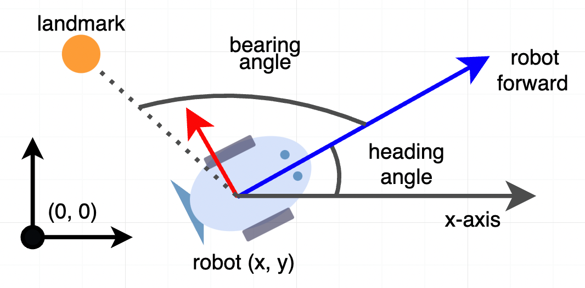
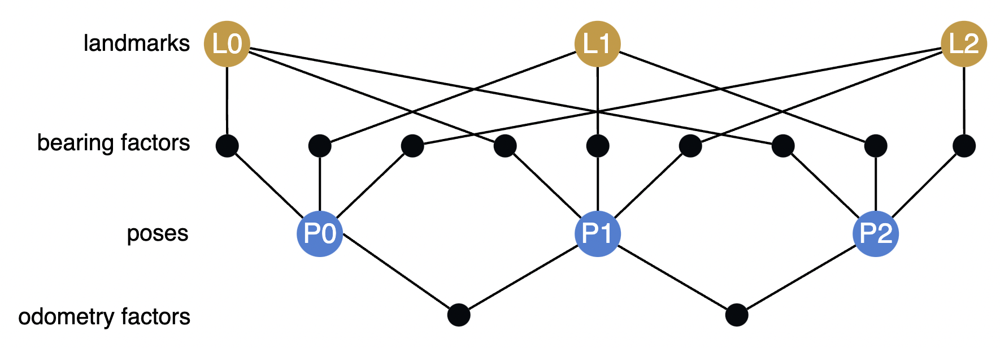

<!-- There's no good way to make an image that's different on light/dark mode that also links
    somewhere.  The closest thing is to add a #gh-light-mode-only to the target, which does this,
    but is kinda confusing -->

<!-- DARK_MODE_ONLY -->

<!-- /DARK_MODE_ONLY -->

<p align="center">
<a href="https://github.com/symforce-org/symforce/actions/workflows/ci.yml?query=branch%3Amain"></a>
<a href="https://symforce.org"></a>
<a href="https://github.com/symforce-org/symforce"></a>
<a href="https://github.com/symforce-org/symforce/issues"></a>


<a href="https://pypi.org/project/symforce/"></a>
<a href="https://github.com/symforce-org/symforce/tree/main/LICENSE"></a>
</p>

---

SymForce is a fast symbolic computation and code generation library for robotics applications like computer vision, state estimation, motion planning, and controls. It combines the development speed and flexibility of symbolic mathematics with the performance of autogenerated, highly optimized code in C++ or any target runtime language. SymForce contains three independently useful systems:

+ **Symbolic Toolkit** - builds on the SymPy API to provide rigorous geometric and camera types, lie group calculus, singularity handling, and tools to model complex problems

+ **Code Generator** - transforms symbolic expressions into blazing-fast, branchless code with clean APIs and minimal dependencies, with a template system to target any language

+ **Optimization Library** - a fast tangent-space optimization library based on factor graphs, with a highly optimized implementation for real-time robotics applications

SymForce automatically computes tangent space Jacobians, eliminating the need for any bug-prone handwritten derivatives. Generated functions can be directly used as factors in our nonlinear optimizer. This workflow enables faster runtime functions, faster development time, and fewer lines of handwritten code versus alternative methods.

SymForce is developed and maintained by [Skydio](https://skydio.com/). It is used in production to accelerate tasks like SLAM, bundle adjustment, calibration, and sparse nonlinear MPC for autonomous robots at scale.

<br/>


<br/>

#### Features

 + Symbolic implementations of geometry and camera types with Lie group operations
 + Code generation of fast native runtime code from symbolic expressions, reducing duplication and minimizing bugs
 + Novel tools to compute fast and correct tangent-space jacobians for any expression, avoiding all handwritten derivatives
 + Strategies for flattening computation and leveraging sparsity that can yield 10x speedups over standard autodiff
 + A fast tangent-space optimization library in C++ and Python based on factor graphs
 + Rapid prototyping and analysis of complex problems with symbolic math, with a seamless workflow into production use
 + Embedded-friendly C++ generation of templated Eigen code with zero dynamic memory allocation
 + Highly performant, modular, tested, and extensible code

### Read the paper: <a href="https://arxiv.org/abs/2204.07889">https://arxiv.org/abs/2204.07889</a>

### And watch the video: <a href="https://youtu.be/QO_ltJRNj0o">https://youtu.be/QO_ltJRNj0o</a>

SymForce was published to [RSS 2022](https://roboticsconference.org/). Please cite it as follows:

```
@inproceedings{Martiros-RSS-22,
    author    = {Hayk Martiros AND Aaron Miller AND Nathan Bucki AND Bradley Solliday AND Ryan Kennedy AND Jack Zhu AND Tung Dang AND Dominic Pattison AND Harrison Zheng AND Teo Tomic AND Peter Henry AND Gareth Cross AND Josiah VanderMey AND Alvin Sun AND Samuel Wang AND Kristen Holtz},
    title     = {{SymForce: Symbolic Computation and Code Generation for Robotics}},
    booktitle = {Proceedings of Robotics: Science and Systems},
    year      = {2022},
    doi       = {10.15607/RSS.2022.XVIII.041}
}
```

# Install

Install with pip:

```bash
pip install symforce
```

Verify the installation in Python:
```python
>>> import symforce.symbolic as sf
>>> sf.Rot3()
```

This installs pre-compiled C++ components of SymForce on Linux and Mac using pip wheels, but does not include C++ headers. If you want to compile against C++ SymForce types (like `sym::Optimizer`), you currently need to <a href="#build-from-source">build from source</a>.

# Tutorial

Let's walk through a simple example of modeling and solving an optimization problem with SymForce. In this example a robot moves through a 2D plane and the goal is to estimate its pose at multiple time steps given noisy measurements.

The robot measures:

 * the distance it traveled from an odometry sensor
 * relative bearing angles to known landmarks in the scene

The robot's heading angle is defined counter-clockwise from the x-axis, and its relative bearing measurements are defined from the robot's forward direction:



## Explore the math

Import the SymForce symbolic API, which contains the augmented SymPy API, as well as geometry and camera types:
```python
import symforce.symbolic as sf
```

Create a symbolic 2D pose and landmark location. Using symbolic variables lets us explore and build up the math in a pure form.
```python
pose = sf.Pose2(
    t=sf.V2.symbolic("t"),
    R=sf.Rot2.symbolic("R")
)
landmark = sf.V2.symbolic("L")
```

Let's transform the landmark into the local frame of the robot.  We choose to represent poses as
`world_T_body`, meaning that to take a landmark in the world frame and get its position in the body
frame, we do:
```python
landmark_body = pose.inverse() * landmark
```
$$
\begin{bmatrix}
    R_{re} L_0 + R_{im} L_1 - R_{im} t_1 - R_{re} t_0 \\
    -R_{im} L_0 + R_{re} L_1 + R_{im} t_0 + R_{re} t_1
\end{bmatrix}
$$

You can see that `sf.Rot2` is represented internally by a complex number (𝑅𝑟𝑒, 𝑅𝑖𝑚) and we can study how it rotates the landmark 𝐿.

For exploration purposes, let's take the jacobian of the body-frame landmark with respect to the tangent space of the `Pose2`, parameterized as (𝜃, 𝑥, 𝑦):

```python
landmark_body.jacobian(pose)
```

$$
\begin{bmatrix}
    -L_0 R_{im} + L_1 R_{re} + t_0 R_{im} - t_1 R_{re}, & -R_{re}, & -R_{im} \\
    -L_0 R_{re} - L_1 R_{im} + t_0 R_{re} + t_1 R_{im}, &  R_{im}, & -R_{re}
\end{bmatrix}
$$

Note that even though the orientation is stored as a complex number, the tangent space is a scalar angle and SymForce understands that.

Now compute the relative bearing angle:

```python
sf.atan2(landmark_body[1], landmark_body[0])
```

$$
atan_2(-R_{im} L_0 + R_{re} L_1 + R_{im} t_0 + R_{re} t_1, R_{re} L_0 + R_{im} L_1 - R_{im} t_1 - R_{re} t_0)
$$

One important note is that `atan2` is singular at (0, 0). In SymForce we handle this by placing a symbol ϵ (epsilon) that preserves the value of an expression in the limit of ϵ → 0, but allows evaluating at runtime with a very small nonzero value. Functions with singularities accept an `epsilon` argument:

```python
sf.V3.symbolic("x").norm(epsilon=sf.epsilon())
```
$$
\sqrt{x_0^2 + x_1^2 + x_2^2 + \epsilon}
$$

See the [Epsilon Tutorial](https://symforce.org/tutorials/epsilon_tutorial.html) in the SymForce Docs for more information.

## Build an optimization problem

We will model this problem as a factor graph and solve it with nonlinear least-squares.

First, we need to tell SymForce to use a nonzero epsilon to prevent singularities.  This isn't necessary when playing around with symbolic expressions like we were above, but it's important now that we want to numerically evaluate some results.  For more information, check out the [Epsilon Tutorial](https://symforce.org/tutorials/epsilon_tutorial.html) - for now, all you need to do is this:

```python
import symforce
symforce.set_epsilon_to_symbol()
```

This needs to be done before other parts of symforce are imported - if you're following along in a
notebook you should add this at the top and restart the kernel.

Now that epsilon is set up, we will instantiate numerical [`Values`](https://symforce.org/api/symforce.values.values.html?highlight=values#module-symforce.values.values) for the problem, including an initial guess for our unknown poses (just set them to identity).

```python
import numpy as np
from symforce.values import Values

num_poses = 3
num_landmarks = 3

initial_values = Values(
    poses=[sf.Pose2.identity()] * num_poses,
    landmarks=[sf.V2(-2, 2), sf.V2(1, -3), sf.V2(5, 2)],
    distances=[1.7, 1.4],
    angles=np.deg2rad([[145, 335, 55], [185, 310, 70], [215, 310, 70]]).tolist(),
    epsilon=sf.numeric_epsilon,
)
```

Next, we can set up the factors connecting our variables.  The residual function comprises of two terms - one for the bearing measurements and one for the odometry measurements. Let's formalize the math we just defined for the bearing measurements into a symbolic residual function:

```python
def bearing_residual(
    pose: sf.Pose2, landmark: sf.V2, angle: sf.Scalar, epsilon: sf.Scalar
) -> sf.V1:
    t_body = pose.inverse() * landmark
    predicted_angle = sf.atan2(t_body[1], t_body[0], epsilon=epsilon)
    return sf.V1(sf.wrap_angle(predicted_angle - angle))
```

This function takes in a pose and landmark variable and returns the error between the predicted bearing angle and a measured value. Note that we call `sf.wrap_angle` on the angle difference to prevent wraparound effects.

The residual for distance traveled is even simpler:

```python
def odometry_residual(
    pose_a: sf.Pose2, pose_b: sf.Pose2, dist: sf.Scalar, epsilon: sf.Scalar
) -> sf.V1:
    return sf.V1((pose_b.t - pose_a.t).norm(epsilon=epsilon) - dist)
```

Now we can create [`Factor`](https://symforce.org/api/symforce.opt.factor.html?highlight=factor#module-symforce.opt.factor) objects from the residual functions and a set of keys. The keys are named strings for the function arguments, which will be accessed by name from a [`Values`](https://symforce.org/api/symforce.values.values.html) class we later instantiate with numerical quantities.

```python
from symforce.opt.factor import Factor

factors = []

# Bearing factors
for i in range(num_poses):
    for j in range(num_landmarks):
        factors.append(Factor(
            residual=bearing_residual,
            keys=[f"poses[{i}]", f"landmarks[{j}]", f"angles[{i}][{j}]", "epsilon"],
        ))

# Odometry factors
for i in range(num_poses - 1):
    factors.append(Factor(
        residual=odometry_residual,
        keys=[f"poses[{i}]", f"poses[{i + 1}]", f"distances[{i}]", "epsilon"],
    ))
```

Here is a visualization of the structure of this factor graph:



## Solve the problem

Our goal is to find poses of the robot that minimize the residual of this factor graph, assuming the
landmark positions in the world are known. We create an
[`Optimizer`](https://symforce.org/api/symforce.opt.optimizer.html?highlight=optimizer#module-symforce.opt.optimizer)
with these factors and tell it to only optimize the pose keys (the rest are held constant):
```python
from symforce.opt.optimizer import Optimizer

optimizer = Optimizer(
    factors=factors,
    optimized_keys=[f"poses[{i}]" for i in range(num_poses)],
    # So that we save more information about each iteration, to visualize later:
    debug_stats=True,
)
```

Now run the optimization! This returns an [`Optimizer.Result`](https://symforce.org/api/symforce.opt.optimizer.html?highlight=optimizer#symforce.opt.optimizer.Optimizer.Result) object that contains the optimized values, error statistics, and per-iteration debug stats (if enabled).
```python
result = optimizer.optimize(initial_values)
```

We can check that the optimization succeeded, and look at the final error:
```python
assert result.status == Optimizer.Status.SUCCESS
print(result.error())
```

Let's visualize what the optimizer did. The orange circles represent the fixed landmarks, the blue
circles represent the robot, and the dotted lines represent the bearing measurements.

```python
from symforce.examples.robot_2d_localization.plotting import plot_solution
plot_solution(optimizer, result)
```


All of the code for this example can also be found in `symforce/examples/robot_2d_localization`.

## Symbolic vs Numerical Types

SymForce provides `sym` packages with runtime code for geometry and camera types that are generated from its symbolic `geo` and `cam` packages. As such, there are multiple versions of a class like `Pose3` and it can be a common source of confusion.

The canonical symbolic class [`sf.Pose3`](https://symforce.org/api/symforce.symbolic.html#symforce.symbolic.Pose3) lives in the `symforce` package:
```python
sf.Pose3.identity()
```

The autogenerated Python runtime class [`sym.Pose3`](https://symforce.org/api-gen-py/sym.pose3.html?highlight=pose3#module-sym.pose3) lives in the `sym` package:
```python
import sym
sym.Pose3.identity()
```

The autogenerated C++ runtime class [`sym::Pose3`](https://symforce.org/api-gen-cpp/class/classsym_1_1Pose3.html) lives in the `sym::` namespace:
```C++
sym::Pose3<double>::Identity()
```

The matrix type for symbolic code is [`sf.Matrix`](https://symforce.org/api/symforce.symbolic.html#symforce.symbolic.Matrix), for generated Python is [`numpy.ndarray`](https://numpy.org/doc/stable/reference/generated/numpy.ndarray.html), and for C++ is [`Eigen::Matrix`](https://eigen.tuxfamily.org/dox/group__TutorialMatrixClass.html).

The symbolic classes can also handle numerical values, but will be dramatically slower than the generated classes. The symbolic classes must be used when defining functions for codegen and optimization. Generated functions always accept the runtime types.

The `Codegen` or `Factor` objects require symbolic types and functions to do math and generate code. However, once code is generated, numerical types should be used when invoking generated functions and in the initial values when calling the `Optimizer`.

As a convenience, the Python `Optimizer` class can accept symbolic types in its `Values` and convert to numerical types before invoking generated functions. This is done in the tutorial example for simplicity.

## Generate runtime C++ code

Let's look under the hood to understand how that optimization worked. For each factor, SymForce introspects the form of the symbolic function, passes through symbolic inputs to build an output expression, automatically computes tangent-space jacobians of those output expressions w.r.t. the optimized variables, and generates fast runtime code for them.

The [`Codegen`](https://symforce.org/api/symforce.codegen.codegen.html?highlight=codegen#module-symforce.codegen.codegen) class is the central tool for generating runtime code from symbolic expressions. In this case, we pass it the bearing residual function and configure it to generate C++ code:
```python
from symforce.codegen import Codegen, CppConfig

codegen = Codegen.function(bearing_residual, config=CppConfig())
```

We can then create another `Codegen` object that computes a Gauss-Newton linearization from this Codegen object. It does this by introspecting and symbolically differentiating the given arguments:
```python
codegen_linearization = codegen.with_linearization(
    which_args=["pose"]
)
```

Generate a C++ function that computes the linearization wrt the pose argument:
```python
metadata = codegen_linearization.generate_function()
print(open(metadata.generated_files[0]).read())
```

This C++ code depends only on Eigen and computes the results in a single flat function that shares all common sub-expressions:

```c++
#pragma once

#include <Eigen/Core>

#include <sym/pose2.h>

namespace sym {

/**
 * This function was autogenerated from a symbolic function. Do not modify by hand.
 *
 * Symbolic function: bearing_residual
 *
 * Args:
 *     pose: Pose2
 *     landmark: Matrix21
 *     angle: Scalar
 *     epsilon: Scalar
 *
 * Outputs:
 *     res: Matrix11
 *     jacobian: (1x3) jacobian of res wrt arg pose (3)
 *     hessian: (3x3) Gauss-Newton hessian for arg pose (3)
 *     rhs: (3x1) Gauss-Newton rhs for arg pose (3)
 */
template <typename Scalar>
void BearingFactor(const sym::Pose2<Scalar>& pose, const Eigen::Matrix<Scalar, 2, 1>& landmark,
                   const Scalar angle, const Scalar epsilon,
                   Eigen::Matrix<Scalar, 1, 1>* const res = nullptr,
                   Eigen::Matrix<Scalar, 1, 3>* const jacobian = nullptr,
                   Eigen::Matrix<Scalar, 3, 3>* const hessian = nullptr,
                   Eigen::Matrix<Scalar, 3, 1>* const rhs = nullptr) {
  // Total ops: 66

  // Input arrays
  const Eigen::Matrix<Scalar, 4, 1>& _pose = pose.Data();

  // Intermediate terms (24)
  const Scalar _tmp0 = _pose[1] * _pose[2];
  const Scalar _tmp1 = _pose[0] * _pose[3];
  const Scalar _tmp2 = _pose[0] * landmark(1, 0) - _pose[1] * landmark(0, 0);
  const Scalar _tmp3 = _tmp0 - _tmp1 + _tmp2;
  const Scalar _tmp4 = _pose[0] * _pose[2] + _pose[1] * _pose[3];
  const Scalar _tmp5 = _pose[1] * landmark(1, 0);
  const Scalar _tmp6 = _pose[0] * landmark(0, 0);
  const Scalar _tmp7 = -_tmp4 + _tmp5 + _tmp6;
  const Scalar _tmp8 = _tmp7 + epsilon * ((((_tmp7) > 0) - ((_tmp7) < 0)) + Scalar(0.5));
  const Scalar _tmp9 = -angle + std::atan2(_tmp3, _tmp8);
  const Scalar _tmp10 =
      _tmp9 - 2 * Scalar(M_PI) *
                  std::floor((Scalar(1) / Scalar(2)) * (_tmp9 + Scalar(M_PI)) / Scalar(M_PI));
  const Scalar _tmp11 = Scalar(1.0) / (_tmp8);
  const Scalar _tmp12 = std::pow(_tmp8, Scalar(2));
  const Scalar _tmp13 = _tmp3 / _tmp12;
  const Scalar _tmp14 = _tmp11 * (_tmp4 - _tmp5 - _tmp6) - _tmp13 * (_tmp0 - _tmp1 + _tmp2);
  const Scalar _tmp15 = _tmp12 + std::pow(_tmp3, Scalar(2));
  const Scalar _tmp16 = _tmp12 / _tmp15;
  const Scalar _tmp17 = _tmp14 * _tmp16;
  const Scalar _tmp18 = _pose[0] * _tmp13 + _pose[1] * _tmp11;
  const Scalar _tmp19 = _tmp16 * _tmp18;
  const Scalar _tmp20 = -_pose[0] * _tmp11 + _pose[1] * _tmp13;
  const Scalar _tmp21 = _tmp16 * _tmp20;
  const Scalar _tmp22 = std::pow(_tmp8, Scalar(4)) / std::pow(_tmp15, Scalar(2));
  const Scalar _tmp23 = _tmp18 * _tmp22;

  // Output terms (4)
  if (res != nullptr) {
    Eigen::Matrix<Scalar, 1, 1>& _res = (*res);

    _res(0, 0) = _tmp10;
  }

  if (jacobian != nullptr) {
    Eigen::Matrix<Scalar, 1, 3>& _jacobian = (*jacobian);

    _jacobian(0, 0) = _tmp17;
    _jacobian(0, 1) = _tmp19;
    _jacobian(0, 2) = _tmp21;
  }

  if (hessian != nullptr) {
    Eigen::Matrix<Scalar, 3, 3>& _hessian = (*hessian);

    _hessian(0, 0) = std::pow(_tmp14, Scalar(2)) * _tmp22;
    _hessian(0, 1) = 0;
    _hessian(0, 2) = 0;
    _hessian(1, 0) = _tmp14 * _tmp23;
    _hessian(1, 1) = std::pow(_tmp18, Scalar(2)) * _tmp22;
    _hessian(1, 2) = 0;
    _hessian(2, 0) = _tmp14 * _tmp20 * _tmp22;
    _hessian(2, 1) = _tmp20 * _tmp23;
    _hessian(2, 2) = std::pow(_tmp20, Scalar(2)) * _tmp22;
  }

  if (rhs != nullptr) {
    Eigen::Matrix<Scalar, 3, 1>& _rhs = (*rhs);

    _rhs(0, 0) = _tmp10 * _tmp17;
    _rhs(1, 0) = _tmp10 * _tmp19;
    _rhs(2, 0) = _tmp10 * _tmp21;
  }
}

}  // namespace sym
```

SymForce can also generate runtime Python code that depends only on `numpy`.

The code generation system is written with pluggable [jinja](https://palletsprojects.com/p/jinja/) templates to minimize the work to add new backend languages. Some of our top candidates to add are TypeScript, CUDA, and PyTorch.

## Optimize from C++

Now that we can generate C++ functions for each residual function, we can also run the optimization purely from C++ to get Python entirely out of the loop for production use.

```c++
const int num_poses = 3;
const int num_landmarks = 3;

std::vector<sym::Factor<double>> factors;

// Bearing factors
for (int i = 0; i < num_poses; ++i) {
    for (int j = 0; j < num_landmarks; ++j) {
        factors.push_back(sym::Factor<double>::Hessian(
            sym::BearingFactor<double>,
            {{'P', i}, {'L', j}, {'a', i, j}, {'e'}},  // keys
            {{'P', i}}  // keys to optimize
        ));
    }
}

// Odometry factors
for (int i = 0; i < num_poses - 1; ++i) {
    factors.push_back(sym::Factor<double>::Hessian(
        sym::OdometryFactor<double>,
        {{'P', i}, {'P', i + 1}, {'d', i}, {'e'}},  // keys
        {{'P', i}, {'P', i + 1}}  // keys to optimize
    ));
}

const auto params = sym::DefaultOptimizerParams();
sym::Optimizer<double> optimizer(
    params,
    factors,
    sym::kDefaultEpsilon<double>
);

sym::Values<double> values;
for (int i = 0; i < num_poses; ++i) {
    values.Set({'P', i}, sym::Pose2d::Identity());
}

// Set additional values
values.Set({'L', 0}, Eigen::Vector2d(-2, 2));
values.Set({'L', 1}, Eigen::Vector2d(1, -3));
values.Set({'L', 2}, Eigen::Vector2d(5, 2));
values.Set({'d', 0}, 1.7);
values.Set({'d', 1}, 1.4);
const std::array<std::array<double, 3>, 3> angles = {
    {{55, 245, -35}, {95, 220, -20}, {125, 220, -20}}
};
for (int i = 0; i < angles.size(); ++i) {
    for (int j = 0; j < angles[0].size(); ++j) {
        values.Set({'a', i, j}, angles[i][j] * M_PI / 180);
    }
}
values.Set('e', sym::kDefaultEpsilond);

// Optimize!
const auto stats = optimizer.Optimize(values);

std::cout << "Exit status: " << stats.status << std::endl;
std::cout << "Optimized values:" << values << std::endl;
```

This tutorial shows the central workflow in SymForce for creating symbolic expressions, generating code, and optimizing. This approach works well for a wide range of complex problems in robotics, computer vision, and applied science.

However, each piece may also be used independently. The optimization machinery can work with handwritten functions, and the symbolic math and code generation is useful outside of any optimization context.


<!-- $
<span style="color:blue">TODO: I wanted to show `sf.V1(sm.atan2(landmark_body[1], landmark_body[0])).jacobian(pose.R)`, but you have to call `sm.simplify` to get the expression to -1, otherwise it's more complicated. All this is also showing up extraneously in the generated code. Discuss what to show.</span>

\frac{
    (-\frac{
        (-R_{im} L_0 + R_{re} L_1 + R_{im} t_0 + R_{re} t_1)^2
    }{
        (R_{re} L_0 + R_{im} L_1 - R_{im} t_1 - R_{re} t_0)^2
    } + \frac{

        }{

        })(R_{re} L_0 + R_{im} L_1 - R_{im} t_1 - R_{re} t_0)^2
    }{
        (-R_{im} L_0 + R_{re} L_1 + R_{im} t_0 + R_{re} t_1)^2 +
        (R_{re} L_0 + R_{im} L_1 - R_{im} t_1 - R_{re} t_0)^2
    }
$ -->

To learn more, visit the SymForce tutorials [here](https://symforce.org/#guides).

# Build from Source

For best results, you should build from the [latest tagged release](https://github.com/symforce-org/symforce/releases/latest).  You can also build from `main`, or from another branch, but everything is less guaranteed to work.

SymForce requires Python 3.8 or later. The build is currently tested on Linux and macOS, SymForce on Windows is untested (see [#145](https://github.com/symforce-org/symforce/issues/145)).  We strongly suggest creating a virtual python environment.

Install the `gmp` package with one of:
```bash
apt install libgmp-dev            # Ubuntu
brew install gmp                  # Mac
conda install -c conda-forge gmp  # Conda
```

SymForce contains both C++ and Python code. The C++ code is built using CMake.  You can build the package either by calling pip, or by calling CMake directly.  If building with `pip`, this will call CMake under the hood, and run the same CMake build for the C++ components.

If you encounter build issues, please file an [issue](https://github.com/symforce-org/symforce/issues).

## Build with pip

If you just want to build and install SymForce without repeatedly modifying the source, the recommended way to do this is with pip.  From the symforce directory:
```bash
pip install .
```

If you're modifying the SymForce Python sources, you can do an [editable install](https://pip.pypa.io/en/stable/topics/local-project-installs/#editable-installs) instead.  This will let you modify the Python components of SymForce without reinstalling.  If you're going to repeatedly modify the C++ sources, you should instead build with CMake directly as described <a href="#build-with-cmake">below</a>.  From the symforce directory:
```bash
pip install -e .
```

You should then [verify your installation](#verify-your-installation).

___Note:___ `pip install .` will not install pinned versions of SymForce's dependencies, it'll install any compatible versions.  It also won't install all packages required to run all of the SymForce tests and build all of the targets (e.g. building the docs or running the linters).  If you want all packages required for that, you should `pip install .[dev]` instead (or one of the other groups of extra requirements in our `setup.py`).  If you additionally want pinned versions of our dependencies, which are the exact versions guaranteed by CI to pass all of our tests, you can install them from `pip install -r requirements_dev_py3<version>.txt`.

_Note: Editable installs as root with the system python on Ubuntu (and other Debian derivatives) are broken on `setuptools<64.0.0`.  This is a [bug in Debian](https://ffy00.github.io/blog/02-python-debian-and-the-install-locations/), not something in SymForce that we can fix.  If this is your situation, either use a virtual environment, upgrade setuptools to a version `>=64.0.0`, or use a different installation method._

## Build with CMake

If you'll be modifying the C++ parts of SymForce, you should build with CMake directly instead - this method will not install
SymForce into your Python environment, so you'll need to add it to your PYTHONPATH separately.

Install dependencies required to build and run SymForce:
```bash
pip install -r requirements_build.txt
```

___Note:___ `requirements_build` contains only packages required to build and run symforce, but not everything recommended to develop symforce, like to run the SymForce tests and linters.  For that, install the full pinned requirements using `pip install -r requirements_dev_py3<version>.txt` for your Python version.

Build SymForce (requires C++14 or later):
```bash
mkdir build
cd build
cmake ..
make -j $(nproc)
```

You'll then need to add SymForce (along with `gen/python` and `third_party/skymarshal` within symforce and `lcmtypes/python2.7` within the build directory) to your PYTHONPATH in order to use them, for example:

```bash
export PYTHONPATH="$PYTHONPATH:/path/to/symforce:/path/to/symforce/build/lcmtypes/python2.7"
```

If you want to install SymForce to use its C++ libraries in another CMake project, you can do that with:
```bash
make install
```

SymForce does not currently integrate with CMake's `find_package` (see [#209](https://github.com/symforce-org/symforce/issues/209)), so if you do this you currently need to add its libraries as link dependencies in your CMake project manually.

## Verify your installation
```python
>>> import symforce
>>> symforce.get_symbolic_api()
'symengine'
>>> from symforce import cc_sym
```

If you see `'sympy'` here instead of `'symengine'`, or can't import `cc_sym`, your installation is probably broken and you should submit an [issue](https://github.com/symforce-org/symforce/issues).

# License

SymForce is released under the [Apache 2.0](https://spdx.org/licenses/Apache-2.0.html) license.

See the [LICENSE](https://github.com/symforce-org/symforce/blob/main/LICENSE) file for more information.

# Sponsors

SymForce is developed and maintained by [Skydio](https://skydio.com/). It is released as a free and open-source library for the robotics community.

<a href="http://skydio.com#gh-light-mode-only">
    
</a>
<!-- DARK_MODE_ONLY -->
<a href="http://skydio.com#gh-dark-mode-only">
    
</a>
<!-- /DARK_MODE_ONLY -->

# Contributing

While SymForce already powers tens of thousands of robots at Skydio, the public library is new and we are releasing it in beta stage. This is just the beginning, and we are excited for engagement from the community. Thank you for helping us develop SymForce! The best way to get started is to file [issues](https://github.com/symforce-org/symforce/issues) for bugs or desired features.

There are many features we're excited to add to SymForce and would love to see contributed by the community. Most are outlined in the issues, but some major desired contributions are:

- Add more backend languages, such as TypeScript and GLSL/HLSL, and improvements to the experimental CUDA and PyTorch backends
- Support for WebAssembly compilation
- More Lie group types, in particular Sim(3)
- Support for constraints in our optimizer
- Integration with [ISPC](https://ispc.github.io/)
- Windows and conda packages
